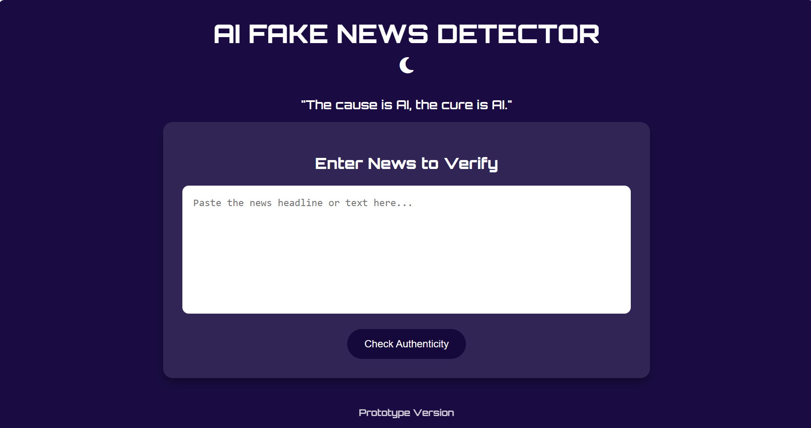
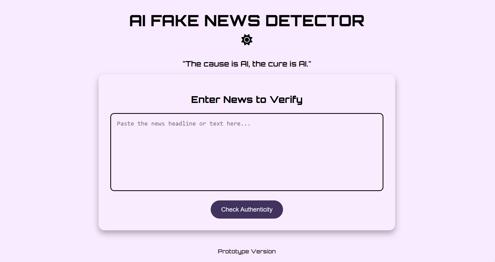
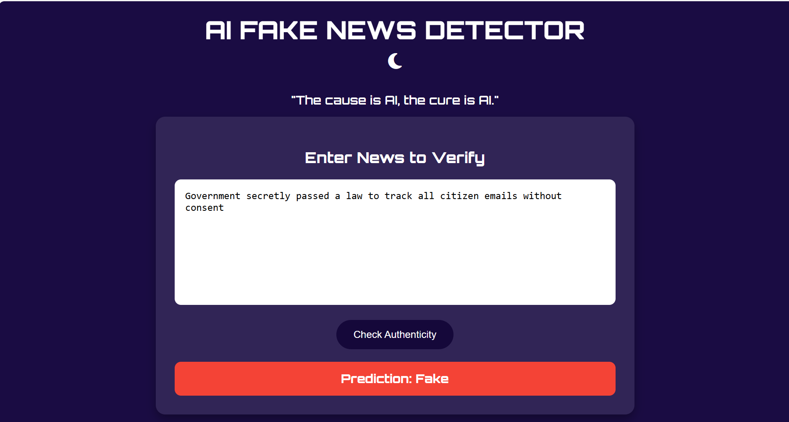
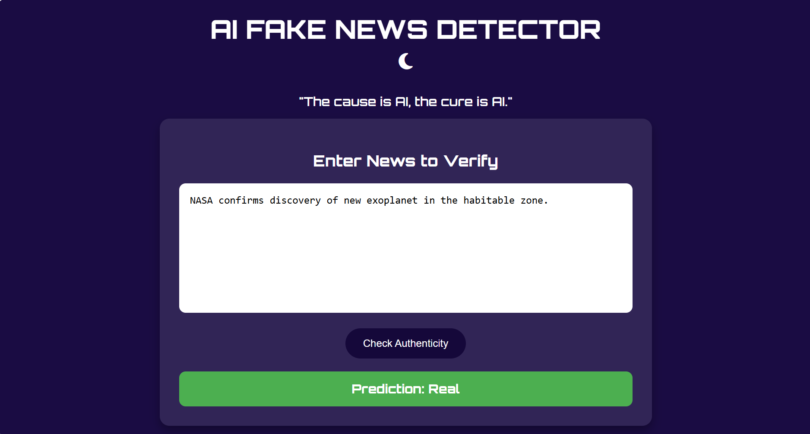

# Ai-Fake-News-Detector

A **Flask web application** that detect whether a news headline or article is **Fake or Real** using a trained **Logistic Regression + TF-IDF** model.

## Project Overview

In today's world , fake news spreads 70% faster than real news according to MIT study.
This project aim to **automatically detects fake news** to help users verify authenticity before sharing.

Built using Python, Flask, Html, css,js
Trained on liar2 and FakeNewsNet datasets for robust detection 
- **Incorporates live news** from the [newsdata.io API](https://newsdata.io/) for dynamic weak labeling. 
Features **dark/light mode UI** and user-friendly interface.

##  Features

- Paste a news headline or article for verification.  
- Predicts if news is **Fake ** or **Real ** instantly.  
- Incorporates **live news from newsdata.io** to improve real-world relevance.  
- Clean, responsive, and minimal design.  
- Easy to deploy with Flask.

##How to run locally
Clone the repository:

```bash
git clone https://github.com/subha19012005/Ai-Fake-News-Detection.git
cd Ai-Fake-News-Detection

Install dependencies:
pip install -r requirement.txt

Run the Flask app:
python app.py

Open your browser at http://127.0.0.1:5000 and test your news headlines.

⚠️ Note: The app uses newsdata.io API for fetching live news. Make sure the API key is valid if you plan to run this feature.

Ai-Fake-News-Detection/
│
├── app.py                   # Flask backend
├── tfidf_vectorizer.pkl      # Saved TF-IDF vectorizer
├── logreg_model.pkl          # Logistic Regression model
├── templates/
│    └── index.html           # Frontend HTML page
├── requirement.txt           # Dependencies
├── Final_Model.ipynb         # Model training notebook
├── Preprocessing.ipynb       # Dataset preprocessing notebook
├── README.md                 # Project documentation
├── images/                   # Screenshots or assets


Screenshot:






Author
P.Subha Paramesh -B.E. CSE Student

License

This project is licensed under the MIT License – see the License file for details.


